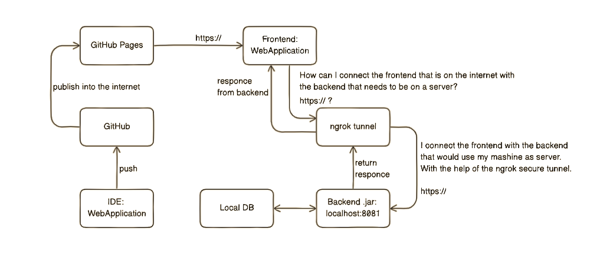

This is a learning side project in which I am learning 
about Git, GitHub, RestApis, Spring Boot, Databases and Security in the internet.

What have I learned until this moment:
1. Git
- you must use it
- after the creation of terrible, unuseful code that introduces only bugs, you can go back to your last working commit
- you can divide to project code into branches that would function as a separate application/projects
- git commit -am "commit text", combine the "commit" and "add ." in one line

2. Github
- there is a way to automate part of your code
- must learn and understand it before trying stupid things

3. Spring Boot
- extremely useful, helps you a lot
- Lombok saves you time
- @Configuration can change how Spring Boot works, but you use it to your advantage
- To create and set custom annotations and exceptions
- Spring Data JPA prevents by default SQL injection attacks

4. Databases
- UUID is better for ID that uses as type SERIAL

5. Security
- http can be used when you are working locally with localhost
- https requires SSL or TLS certificate
- GitHub pages provides https
- to connect to https code for example that uses GitHub pages a CORS error occurs
- CORS is a mechanism to restrict users from accessing shared resources
- to bypass so to say we need a tunnel, ngrok can make one
- a tunnel that is in one end https and in the other localhost:PORT

Diagram of the project:

This diagram is representing how I found a way to connect my frontend and backend using https:// and the project to be on the internet.

Some downsides are that if the computer is turned off the backend would be shutdown completely, 
because the computer works as a server. In addition to that, the ngrok that makes the https tunnel between the 
can only work properly for 2 hours, after that it (the tunnel) needs to be changed.

However, the issue with the tunnel can be overcome by automating the change of the tunnel!
