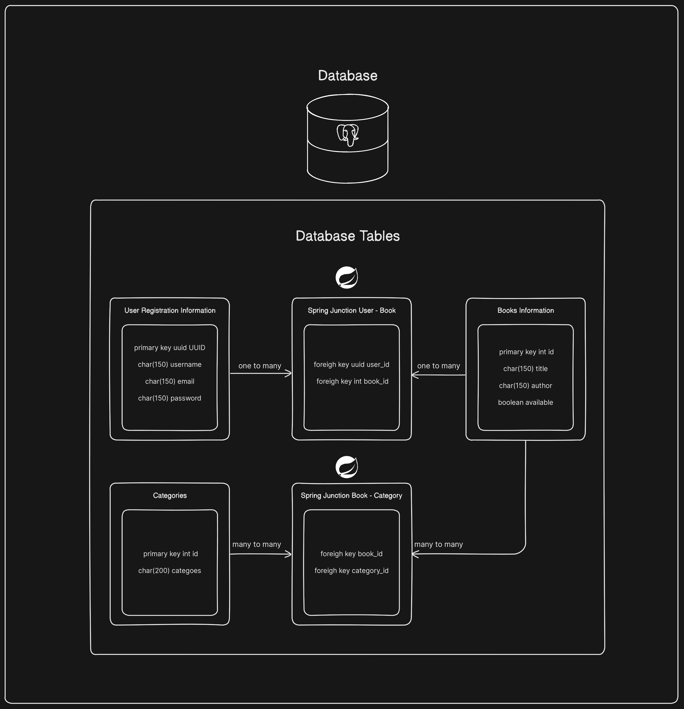

# Monolithic architecture project 
This side project stands as one of my most complex and ambitious undertakings, showcasing my growing skills and commitment.
Date: 03/10/2023

# The project's components break down as follows:
- Frontend: Comprising a login page, signup page, and a work-in-progress webpage intended to showcase products.
The products at the moment are books. This may change in the future!

- Backend: Encompassing a RestApi, incorporating custom Spring annotations and exceptions, configuring 
the Spring environment, implementing security measures, and utilizing Spring JPA for database interaction.
Also, using hibernate to create junction tables and establish relationships between components!

- Database: I am using PostgreSQL database, which I use to create the main tables where a module object information stays.
All the relations and junction tables are established by hibernate and the DB tables do not have a relation set between them,
by Postgres.

# Diagram of the Database connection and relationships

